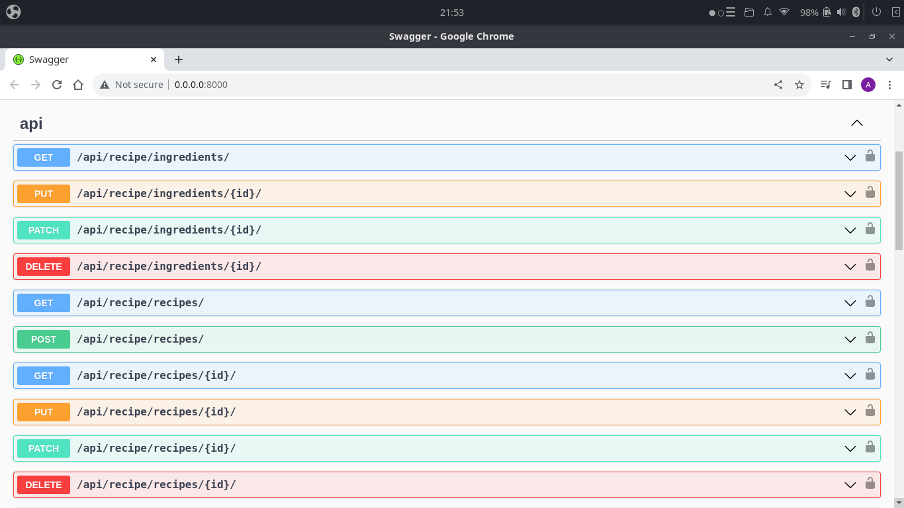

# Recipe API

Desenvolvimento de uma API de receitas culinárias com os frameworks Django, Django Rest Framework, Docker, PostgreSQL, Docker e Unittest. Seguido boas práticas de programação com Desenvolvimento Orientado por Testes ou TDD (Test Driven Development).

Dependência:
* Docker version 20.10.17, build 100c701
* Docker Compose version v2.6.0
* Python 3.10.4

Pacotes Python:

```txt
Django>=3.2.4,<3.3
djangorestframework>=3.12.4,<3.13
drf-spectacular
Pillow>=8.2.0,<8.3.0
psycopg2>=2.8.6,<2.9
uwsgi>=2.0.19,<2.1
whitenoise>=5.2.0,<6.2.0
```

## Rode o Projeto:

Crie um ambiente virtual e instale as depêndencias:
```bash
virtualenv venv
source venv/bin/activate
pip install -r requirements.txt
pip install -r requirements-dev.txt
```

Rode os testes:
```bash
sudo docker compose run --rm app sh -c "python manage.py test --verbosity 2"
```

Suba o container com a aplicação:
```bash
sudo docker compose up
```


